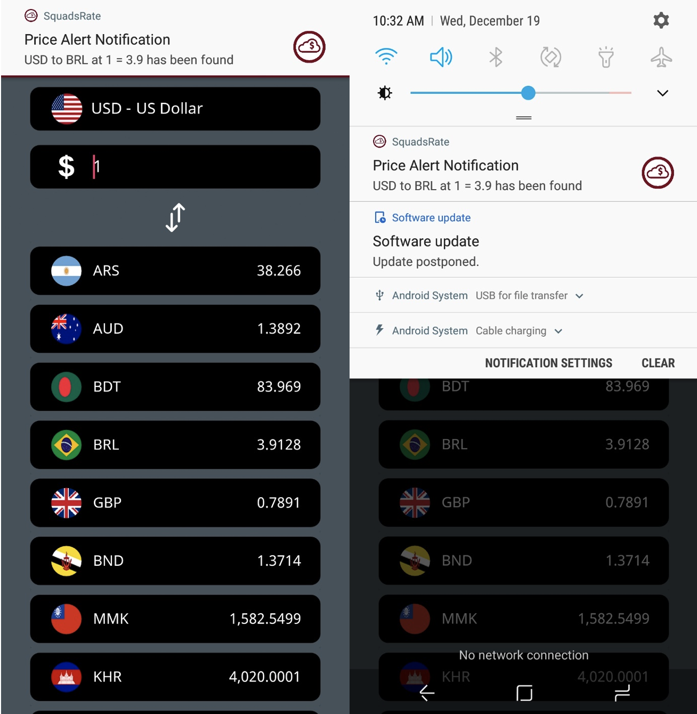

# Currency Converter Android App

### Developed in 2018

Currency Converters are essential determinants of a country’s relative level of economic health and individual business. So, I came up with the idea “Currency Exchange Rates” application. There are many applications regarding currency exchange rates in the Play Store, but some of those don’t provide enough features, and user interfaces are also not very friendly. That is why I developed this application using all my improvised features and UX/UI designs layout that will provide the best experience for users. The features will be listed below and the layouts.

## Home Layout

## Navigation Bar

## Calculator Layout

## Search Currencies Layout

## Histories Layout

## Alert Page Setup

## Notification Alert

